# 一，计算机基础
## $\underline{图灵的主要贡献}$,以及了解图灵机
### $\underline{图灵的主要贡献}$
* 图灵机
* 图灵测试
### 图灵机

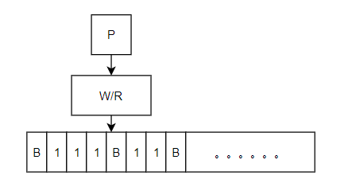
* M是一个无限长，被分成一个个单元的带
* P是一个有限状态控制器，能使W/R左移或右移，并能对M上的符号进行修改或读出
## $\underline{冯诺依曼原理的基本思想，冯诺依曼计算机的主要特点}$
* **存储方式**，将程序和数据在同一个存储器中存储
* **存储器是按地址访问的线性编址的唯一结构**，每个单元位数固定
* **指令由操作码和地址码组成**，操作码指明操作类型，地址码指明操作数的存放地址
* **通过执行指令直接发出控制信号控制计算机**，指令按执行顺序存放，由指令计数器指明要执行的指令所在的单位地址
* **机器以运算器为中心**，输入输出，存储器之间的数据传送都经过运算器
* **数据以二进制表示**
## 计算机时代开始于哪一年,$\underline{主要标志，发展阶段}$
* 1951年(走向社会)
### 第一代计算机(1951-1958)
#### 特点
* 采用电子管代替机械齿轮或电磁继电器作开关
  * 笨重，产热大，易损坏
* 采用二进制代替十进制
* 程序可存储(后采用磁芯磁鼓存储)
  * 一个磁芯可存储一个二进制数
* 输入输出主要用穿孔卡
  * 速度慢
### 第二代计算机(1959-1964)
#### 特点
* 用晶体管代替电子管
  * 体积小，重量轻
  * 发热少，耗电省
  * 速度快，功能强
  * 价格低，寿命长
* 普遍采用磁芯存储器作主存，采用磁盘或磁带作辅存
  * 存储容量增大，可靠性提高(促进软件发展)
* 计算机体系结构特性出现
* 编程语言发展
* 应用范围扩大
### 第三代计算机(1965-1970)
#### 特点
* 用集成电路(IC)取代晶体管，开始时小规模集成电路(SSI)，后时大规模集成电路(LSI)
  * IC体积更小，耗电更省，功能更强
* 用半导体存储器淘汰了磁芯存储器
  * 存储容量大幅提升(促进建立存储体系与管理)
* 采用微程序设计技术
  * 促进计算机走向系列化，通用化，标准化
* 系统软件与应用软件发展
  * 出现模块化程序设计方法
### 第四代计算机(1971-)
#### 特点
* 用微处理器或超大规模集成电路(SSI)取代普通集成电路
* 存储容量进一步扩大
* 出现新的输入输出存储方式，新编程语言
* 微型计算机兴起
* 计算机技术与通信技术结合
* 在并行处理与多处理领域积累经验
## 计算机分类和特点
### 计算机的分类
* 有按处理器位数分
  * 8位机、16 位机、32位机、64位机
* 有按主要元器来分
  * 电子管计算机、晶体管计算机、集成电路计算机、越大规模集成电路计算机
* 有按用途来分
  * 军用计算机、商用计算机、家用计算机、通用计算机、专用计算机等
* **按体积大小、处理速度和成本分**
  * 超级计算机、大型机、小型计算机、微型机、嵌入式计算机等
### 计算机的特点
* 高速，精确的运算能力
* 准确的逻辑判断能力
* 强大的存储能力
* 自动能力
* 网络与通信能力
## $\underline{摩尔定律}$
* 当价格不变时，集成电路上可容纳的晶体管数目，约每隔18个月便会增加一倍，性能也将提升一倍。
## 我国计算机的发展
* 1958年，中国第一台数字电子计算机103机
* 1959年,中国第一台大型数字电子计算机104机
* 1961年，我国第一个自行设计的编译系统用试验成功
* 1967年，大型晶体管计算机109乙，中国第一台具有分时，中断系统和管理程序的计算机
* 1983年，“银河-I”巨型机，高速计算机研制的里程碑
* 1983年，长城0520CH微机，微机汉字软件CCDOS
* 1991年，汉字激光照照排系统(汉字印刷术的第二次发明)
* 1994年，中国正式被国际上承认为接入Internet的国家
## $\underline{数的表示和数制转换}$
* 计算机中所有信息都必须通过二进制形式编码
### $\underline{数的表示}$
* 数由**数码**和**权**构成
* 数码的个数称为**基数**
* 数字后加字母表示数制
  * B，二进制
  * O，八进制
  * D，十进制
  * H，十六进制
### 数的定点与浮点表示(涉及小数点位置)
* 符号也用二进制数码表示(通常正为0，负为1)
#### 定点数表示
* 任意一个二进制数总可以表示为纯整数（或纯小数）和一个2的整数次幂的乘积
  * N=2^P^×S
    * S称为N的**尾数**，表示了N全部有效数字
    * P称为N的**阶码**，指明小数点的位置
    * 2称为阶码的**底**
  * 阶码为固定值时，该表示法称为数的定点表示
* **定点小数**：约定小数点在符号位与最高位数值之间
* **定点整数**：约定小数点在最低有效位后面
* 定点数位数确定后，表示范围也确定，若超出则称为**溢出**(或两数相加结果异号)
#### 浮点数表示
* 阶码可取不同值，并与尾数一并表示

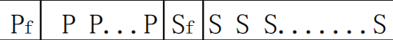
  * N=2^P^×S
    * P~f~称为阶码的符号位
    * 尾数S一般为纯小数，用定点小数表示
    * S~f~表示尾数的符号位
* 计算机表示浮点数要分为阶码和尾数表示
  * 阶码部分的位数决定了数的表示范围
  * 尾数部分的尾数决定了数的精度
### 数制转换
* 原理：两有理数相等时，整数部分和小数部分一定分别相等
* 十进制转二进制，连除二取余
  * 十进制小数转二进制小数时，若结果为无限小数则零舍一入求近似值
* 二进制转十进制，连乘二取和
## $\underline{计算机为什么要采用二进制}$
* 二进制只有两种状态，易于实现
* 二进制运算规则简单
* 二进制信息存储和传输可靠
* 二进制节省设备
* 可以用逻辑代数作为逻辑分析与设计的工具
## $\underline{数的码制：原码，反码，补码以及算术运算}$
* 符号被“数码化”，0表示正数符号，1表示负数符号
* 将符号化的数称为**机器码**，一般是固定长度，数的位不够时应当补足
* **原码**，正数符号用0，负数符号用1，数值部分即为该数本身
* **补码**，
  * 负数：符号位不变，其他各位取反，然后在最低位加一
    * 若已知负数补码[X]~补~，可通过除符号位外求反，加一，得原码[X]~原~
  * 正数：不变
* **反码**，除符号位外取反
* 加法：[X+Y]~补~=[X]~补~＋[Y]~补~(若为同一符号，则结果符号不变)
* 减法：[X－Y]~补~=[X]~补~＋[－Y]~补~
* 乘法：被乘数左移和加法
* 除法：被乘数移位和减法
## 逻辑运算
* 与，$\land$，同为1异为1
* 或，$\lor$，有1为1
* 非，$\lnot$，取反
* 异或，$\otimes$，同为0异为1
* 同或，同为1异为0
* 逻辑运算符时按位计算，没有进位
## $\underline{算法及算法的特性}$
* **算法**：解题方案的准确而完整的描述
### $\underline{算法的特性}$
* **能行性**
  * 每一步都要能实现
  * 结果能达到预期目的
* **确定性**
  * 每一个步骤都要是确定的，不能模棱两可
* **有穷性**
  * 算法必须包含有限的步骤，在有限的时间内能完成
* **零或多个输入**
* 一个或多个输出
### 算法的表示
* 自然语言
* 传统流程图
* N-S流程图
* PAD图
* 伪代码(PDL)
* 计算机语言
### 算法分析
* **正确性**：输出是否正确
* **简单性**：是否易理解
* **时间复杂性**：当问题规模充分大时，运行该算法所需的时间的数量级
* **空间复杂性**：除原始数据之外，额外占用的存储空间
## $\underline{数据结构的分类，抽象描述}$
**数据结构**包含数据的**逻辑结构**和数据的**存储结构**
通常而言，算法的设计取决于数据的逻辑结构，算法的实现取决于数据的物理结构
**数据**：是对客观事物的符号表示
**数据元素**：时数据集合中的一个实体，时计算机程序中加工处理的基本单位
### $\underline{数据结构的分类}$
* 从逻辑结构分
  * **线性结构**(**链表，树**)
  * **非线性结构**(**图，网**)
* 从存储结构分
  * **顺序结构**：逻辑结构和物理结构相同
  * **链式结构**：通过指针来指示存放位置，物理上不连续
  * **索引存储**：以索引表来指示地址
  * **散列结构**：构造函数，利用函数值确定地址
### $\underline{数据结构的抽象描述}$
* 数据的抽象(逻辑)结构包含数据的**元素**以及相互之间的**逻辑关系**
# 二，计算机工程
## 了解计算机的硬件结构(总线结构)，$\underline{计算机是怎样工作的}$
### 计算机的硬件结构
#### 冯诺依曼结构图

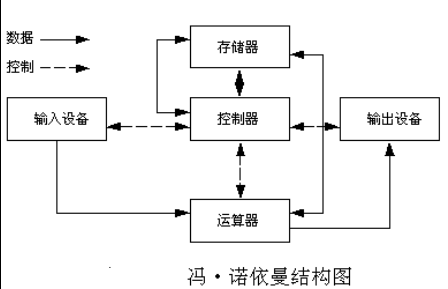
* 输入输出设备，存储器，运算器，控制器
  * **输入设备**：将程序和数据以计算机所能识别和接受信息形式输入到计算机内
  * **输出设备**：将计算机处理过的信息以用户熟悉，方便的形式输送出来
  * **存储器**：存储器是计算机的记忆装置，用来存放原始数据，中间数据，最终结果和处理程序
  * **运算器**：对信息进行加工处理的不见
  * **控制器**：负责对指令进行分析，判断，发出控制信号，使计算机有关设备协调工作
  * **总线**：连接CPU，内外存和各种I/O设备并在其中进行信息传输的传输线以及控制电路
#### 初级计算机结构

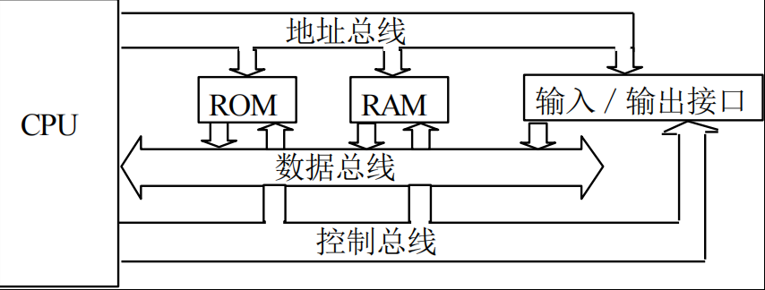
* 初级计算机结构由CPU，存储器，接口电路组成，通过接口电路再与外部设备相连接，之间通过三条总线(地址总线(AB)，双向数据总线(DB)和控制总线(CB))连接
* 程序输入到计算机后，只要告诉计算机程序的起始地址，并发出一个启动命令，机器就被启动来执行这段程序。执行程序过程就是反复取出指令和执行指令
####  $\underline{初级计算机CPU结构}$

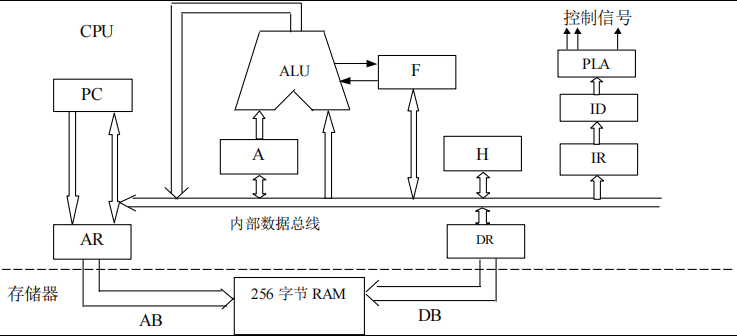
* **算数逻辑单元(ALU)**：执行算数和逻辑运算的装置
* **累加器A**：存放算术逻辑运算中间结果
* **寄存器组H**：由多个寄存器组成，暂时存放数据
* **指令寄存器(IR)**：存放当前正在执行的指令，当前指令执行完后下条指令才能存入，执行完一条指令后，不会清空内容
* **指令译码器(ID)**：对指令进行分析译码，根据指令译码其的输出信号执行当前指令所需的全部控制信号
* **标志寄存器F**：由一些标志位组成，为逻辑判断提供状态信息
* **程序计数器/指令计数器(PC)**：指明将执行的下条指令在存储器中的地址
* **内部数据总线**：把CPU内部各寄存器和ALU连接起来，实现各单元间的信息传输
* **256字节RAM是假想存储器(CPU缓存)**：用于存放指令和数据
* **地址寄存器(AR)**：把要寻址的单元地址通过地址总线送到存储器
* **数据寄存器(DR)**：存放从存储器中读出的数据，并经过内部数据总线送到需要这个数据的寄存器中，或将要写入的存储器的数据经过DR送到存储器
#### 初级的存储器结构

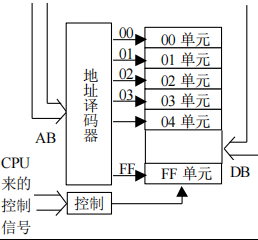
* CPU给出要操作的某存储单元地址，该地址通过地址总线AB送到存储器中的地址译码器，从256个单元中找到相应于该地址码的那个存储单元，然后再对这个单元进行读出或写入操作
* 第一条指令取指阶段
* 控制器和运算器一起组成中央处理器(CPU)
* 通常把控制器，运算器和主存储器一起称为主机
### $\underline{计算机的工作过程}$

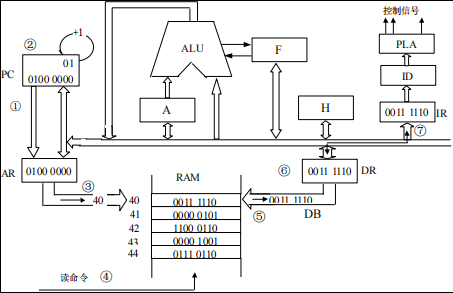
* $PC\xrightarrow[]{PC++}AR\xrightarrow[AB]{}存储器\xrightarrow[]{存储器译码器译码后}选择特定单元\xrightarrow[DB]{CPU发出读命令}DR\xrightarrow[]{}IR\xrightarrow[ID,PLA]{}发出执行该命令$
* 第一条指令执行阶段

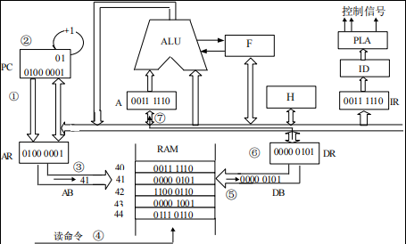
* $PC\xrightarrow[]{PC++}AR\xrightarrow[AB]{}存储器\xrightarrow[]{存储器译码器译码后}选择特定单元\xrightarrow[DB]{CPU发出读命令}DR\xrightarrow[内部数据总线]{}累加器A$
* 再进行第二条指令的取指阶段，循环
## $\underline{中央处理器CPU的结构}$，性能指标
### $\underline{CPU结构}$

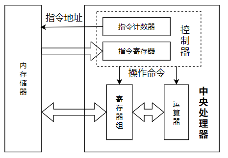
### CPU性能指标
* **主频**：CPU工作时的时钟频率
* **外频**：主板提供的基准频率
* **倍频**：CPU主频相对外频的倍数
* CPU工作频率=倍频X外频
* **指令综合能力**：处理器能执行的指令调试和每条指令的能力
* **地址总线宽度**：PC采用的是总线结构，地址总线宽度(地址总线的位数)决定了CPU可以访问的存储器的容量，使用内存的最大容量
* **数据总线宽度**：决定了CPU与内存，输入输出设备之间一次数据传输的信息量
* **高速缓存**：缓存时位于CPU和内存之间的容量较小但速度很快的存储器，缓存的速度与CPU相当
* **工作电压**：指CPU正常工作时所需的电压，CPU制造工艺越先进，工作电压越低，运行的耗电功率越小
* **协处理器**：进行浮点数运算或进行复杂的数学运算的处理器(一般CPU只能对定点数进行一些简单运算)
* **多核**：单个裸片上具有多个可见的处理器，各处理器之间各自拥有独立的控制和工作状态，互相之间无需共享资源
## 存储器分类，层次结构，性能指标，半导体存储器($\underline{ROM与RAM的区别}$)
### 存储器分类
* 按存取速度分：高速，中速，低速
* 按存储材料分：半导体存储器，磁记录存储器，激光存储器等
* 按功能分：寄存器型存储器，高速缓冲存储器，主存储器，外存储器，后备存储器等
* 按存储方式分：随机存储器，顺序存储器等
以及固态存储器，移动存储器，微型存储器等
### 层次结构
* **寄存器型存储器**：由多个寄存器组成的存储器，CPU内部寄存器组
* **高速缓冲存储器**：到高速小容量存储器，存放的时CPU近期要执行的指令和数据
* **主存储器**：主要存储器，用来存储计算机运行期间较常用的大量程序和数据
* **外存储器**：主机外部存储器，辅助存储器
* 存储器之间的关系

### 性能指标
* **存储容量**：存储器有多少存储单元
* **存取速度**：指从**请求**写入(或读出)到**完成**写入(或读出)一个存储位的时间。包括**找到**存储地址到**传送**数据的时间
  * 半导体存储器的读取时间与地址无关只有一个存储时间，磁盘，光盘的读取时间与地址有关
  * 相关因素：
    * 找道时间，读写头切换时间，磁盘转动延迟时间，数据传输时间
* **数据**：用于外部存储器，衡量与内存交换数据的能力
### $\underline{半导体存储器}$
#### 分类
* 分为三大类：**随机存储器(RAM),只读存储器(ROM)，特殊存储器**
* **随机存储器(RAM)**:
  * 特点：
    * 可以读出写入，读出时补损坏存储内容，写入才修改存储内容
    * **随机存取**：存取任一单元所需时间相同(存取单元排成二维阵列，通过行列地址存取一个单元)
  * 分类
    * **DRAM与SRAM**
      * **DRAM**:动态随机存储器，需要定时充电为此存储内容正确，称为**刷新**
      * **SRAM**：静态随机存储器，双稳态触发器存储，速度快，**用作Cache**、
    * **NVRAM**:一种非易失性的随机读写存储器，既能快速存取，且系统断电时又能不丢失数据
* **只读存储器(ROM)**
  * 特点：
    * 只能读出原有内容，不能写入新内容，非易失
  * 分类
    * **PROM**：可编程只读存储器
    * **EPROM**:可擦除可编程只读存储器(紫外线擦除)
    * **E2PROM**：电可擦除可编程只读存储器
* **特殊存储器**
  * **主存储器**
    * 是CPU可直接访问的存储器，用于存放供CPU处理的指令和数据
    * 由若干内存条组成
      * 内存条上是若干片DRAM芯片
    * 主存是以字节为单位进行连续编址
  * **高速缓冲存储器(Cache)**：是位于主存与CPU之间的高速小容量存储器
  * **磁记录存储器**
    * 按磁介质分：磁盘，磁带
    * 增大存储容量的基本途径：提高磁介质的表面的记录密度
      * 特征
        * **面密度**：单位面积上存储的信息量
        * **道密度**：半径方向上单位长度包含的磁道数
        * **位密度**：单位长度磁道上存储的信息量
      * 硬盘
        * 性能指标
          * **容量**：可容纳的数据量
          * **平均存取时间**==找道时间+旋转等待时间+数据传输时间
          * **转速**：硬盘内部马达旋转的速度
          * **平均寻道时间**：磁头到达目标数据所在磁道的平均时间
          * **缓存**，大小直接影响整体性能
#### 主要技术指标
* **存储容量**
* **存取时间**：在存储器地址被选定后，存储器读出数据并送到CPU(或者是把CPU数据写入存储器)所需要的时间
* **存储器总线带宽**：存储器在单位时间内所存取的二进制信息的位数
* **存储器的可靠性**：存储器的可靠性用平均故障间隔时间MTBF来衡量
* **价格**：常用每位价格来衡量
## $\underline{高速缓冲存储器的作用与运行原理}$
  * 目的：解决CPU与主存之间速度不匹配
  * 存放CPU立即要运行或刚使用过的程序和数据
  * CPU读取数据的顺序：先Cache后内存
  * 特点
    * **透明性**：Cache只能被CPU访问，对用户是透明的
    * **命中率**：指CPU需要的指令或数据在Cache中能直接取到的概率
  * 使用**LRU(近期最少使用算法)**
## 主板架构
* 主板是微型计算机中最大的一块集成电路板，是主体和控制中心，是各种设备的连接载体，控制着各部分之间的工作
* 主要部件
  * **芯片组**
    * 作用：集中了主板上几乎所有的控制电路，是主板电路的核心，决定主板的功能、性能和技术特性
    * 实现CPU与主存等其他设备的数据传输
    * 组成
      * **存储器总线**及**内存控制器(北桥芯片)**和**I/O控制器(南桥芯片)**
  * **CPU插座**
    * 用来固定连接CPU芯片
  * **内存插槽**
    * 插入内存条
  * **扩展插槽**
    * 用于固定扩展卡并将其连接到系统总线上的插槽
  * (基本I/O系统BIOS)
    * BIOS是操作系统最底层的可执行程序代码，通常存放在只读存储器芯片(BIOS芯片)中
      * 主要包含四部分
        * POST(加电自检)程序(检测计算机故障)
        * 系统自举程序(启动计算机)
        * CMOS设置程序(设置和修改CMOS中存储的系统参数)
          * CMOS:存放用户对计算机硬件所设置的一些参数(配置信息)
        * 基本外围设备的驱动程序(实现常用外部设备输入输出操作的控制程序)
  * **总线**

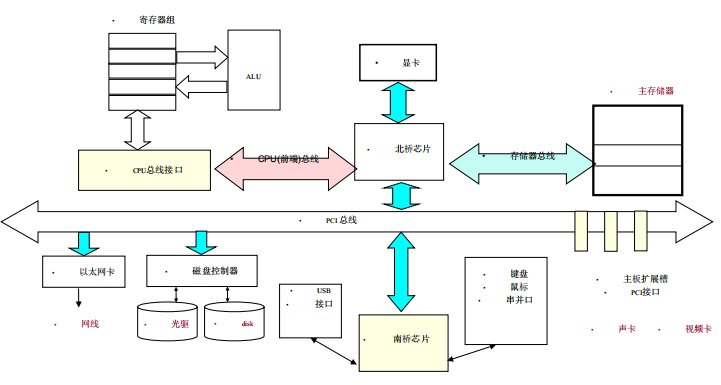
    * CPU、主存储器及输入输出设备之间相互通信的公共通道
    * 包括内部总线、系统总线及外设总线
      * **内部总线**是指CPU内部连接各寄存器与ALU部件的总线，它包含在CPU数据通路内
      * **系统总线**是指计算机系统的CPU、主存储器及I/O接口之间的连线
      * **外设总线**是CPU与外部接口之间的连接线
    * 分类
      * **地址线**(选择信息传送的设备(通常是单向线))
      * **数据线**(总线上的设备之间传送数据信息(通常是双向线))
      * **控制总线**(传输各种控制信号的传输线)
## 了解$\underline{计算机网络定义}$,功能，分类，发展经历，典型的拓扑结构
### $\underline{定义}$
* 计算机网络是用通信设备和线路将分散在不同地点的有独立功能的多个计算机系统互相连接起来，按照网络协议进行数据通信，实现资源共享的计算机集合
* 各种类型的计算机(主机)，如大型机、微型机、笔记本电脑等，用于数据处理，向用户提供服务
* 若干通信设备和线路，用于将多个计算机连接在一起，进行数据传输
* 网络协议，为保证网络中的数据通信而制定的一系列规则和约定
* 网络操作系统和应用软件，实现通信协议、网络资源的管理和应用
### 功能
* **信息传输**.使分散在不同地理位置的计算机之间相互通信
* **资源共享**网络中的用户可以共享各种软件、硬件和信息等资源
* **分布式处理**，可借助于网络中的多台计算机共同协作完成,以便均衡各计算机的负载，提高处理问题的效率。
* **提高可靠性**,冗余备份和协同处理
### 分类
* 按使用的传输介质可分为：有线网,无线网
* 按网络的使用性质可分为：公用网,专用网,虚拟专网(VPN)
* 按网络的使用对象可以分为：企业网,政府网···
• 按网络所覆盖的地域范围可以分为：局域网(LAN)，城域网或市域网(MAN)和广域网(WAN)
### 发展经历
* 第一阶段，面向终端的计算机网络
* 第二阶段，计算机与计算机通信网
  * 提出分组概念，TCP/IP，网关
* 第三阶段，标准化网络阶段
  * 提出系统网络体系结构
* 第四阶段，网络互联与高速网络阶段
  * 建立国家信息基础设施NII
  * 形成了以Internet为核心的高速计算机互联网络
### 典型的拓扑结构

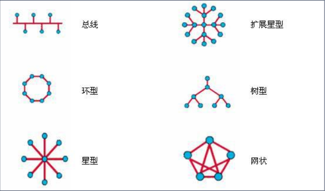
### 组成
* 算机网络由网络硬件和网络软件两大部分组成
## $\underline{网络协议，国际标准OSI参考模型，TCP/IP协议}$，分层的主要原则
### $\underline{网络协议}$
* **通信协议**
  * 协议是为了保证数据通信双方能正确而自动地进行通信制定的一整套约定通信协议。是一套语义和语法规则，用来规定有关功能部件在通信过程中的操作。
  * 特点
    * **层次性**
    * **可靠性和有效性**
* 网络协议的组成
  * **语法**：数据与控制信息的结构或格式
  * **语义**：用于协调和进行差错处理的控制信息
  * **同步(定时)**：对事件实现顺序的详细说明
* 协议只确定计算机各种规定的外部特点，不对内部的具体实现做任何规定
### $\underline{国际标准OSI参考模型(OSI七层结构)}$
* OSI开放系统模型包括物理层、数据链路层、网络层、传输层、会话层、表示层、应用层

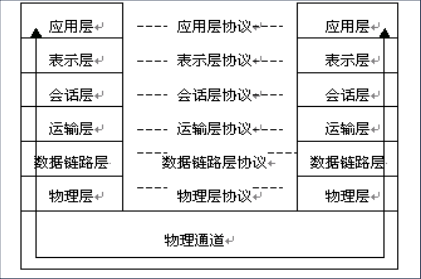
* 划分层次要根据理论上需要的不同等级划分。
* 层次的划分要便于标准化。
* 各层内的功能要尽可能的具有相对独立性。
* 相类似的功能应尽可能放在同一层内。
* 各层的划分要便于层与层之间的衔接。
* 各层的交互要尽量的少。
* 根据需要，在同一层内可以再形成若干个子层次。
* 扩充某一层次的功能或协议，不能影响整体模型的主体结构。
### $\underline{TCP/IP协议}$

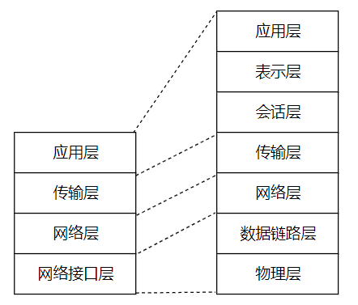
* **应用层**是TCP/IP的最高层，为用户提供各种网络应用程序及应用层协议。
* **传输层**为两台主机上的应用程序提供端到端的通信，主要包括两个协议
  * **TCP**提供可靠的面向连接的传输服务
  * **UDP**提供简单高效的无连接服务
* **网络层**也叫互联网层或IP层，负责将称为IP数据报的数据从一台主机传输到另一台主机
  * 功能包括IP协议和若干路由协议，定义IP数据报的格式，确定IP数据报传输的路由并传输
* **网络接口层**提供与物理网络的接口方法和规范
### 分层的主要原则
#### 实质
  * 将大量的、各类型的协议合理地组织起来，并按功能的先后顺序进行逻辑分割
* 层次结构是指将一个复杂的系统设计问题划分成层次分明的一组组容易处理的子问题，各层执行自己所承担的任务。层与层之间有接口，它们为层与层之间提供了组合的通道。
#### 网络功能分层结构模型

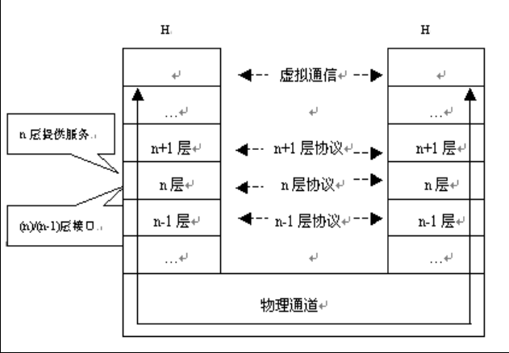
* **系统**：是指由一台或多台计算机、软件系统、终端、外部设备、通信设备和操作人员、管理人员组成的网络系统
* **子系统**：是指系统内部一个个在功能上相互联系，又相对独立的逻辑部分
* **层次**：分层网络系统体系结构中的一个子部分就是一个层次。它是由网络系统中对应的子系统构成的
* **实体**：实体是子系统中的一个活跃单元。分层网络体系结构中，每一层包含一个通信功能子集，一个或一组功能产生一个功能单元，这个功能单元就构成了所谓的实体
* **等同实体**：同一层中的实体称为等同实体，即位于不同子系统的同一层内相互交互的实体
## $\underline{MAC地址，IP地址，域名体系}$
### MAC地址
* 称为物理地址或硬件地址，是一个全局地址，即世界唯一地址
* 格式
  * 6字节(48位)，前3个字节为厂商惟一标识符，后3个字节由生产厂商自行分配
* 生产时，固化在网卡的ROM中
* 网卡上的MAC地址作为该机的唯一入网物理地址，通信时为主机标识
### IP地址
* **主机地址(PI)**
  * 每台计算机也有一个由授权单位分配的号码
  * 采用层次结构
    * 按逻辑网络结构划分
  * 组成
    * 一个IP地址由**网络号**和**主机号**组成，网络号用于识别一个逻辑网络，而主机号用于识别网络中的一台主机
    * IP地址由32位二进制数值组成(4个字节)，采用十进制标记法
    * 类别
      * A，第一字节范围1~126
      * B，第一字节范围128~191
      * C，第一字节范围192~223
    * 对小规模网络，对IP地址中的主机号部分进行再次划分，将其划分成子网号和主机号两部分
      * 再次划分后的IP地址的网络号部分和主机号部分用子网屏蔽码(子网掩码)来区分
        * 子网屏蔽码也为32位二进制数值，分别对应IP地址的32位二进制数值
        * 对于IP地址中的网络号部分在子网屏蔽码中用“1”表示，主机号部分在子网屏蔽码中用“0”表示
* 特殊IP：主机号全0表示子网，主机号全1表示所有主机
### 域名体系
*  Internet的域名结构由TCP／IP协议集中的域名系统(DNS)进行定义

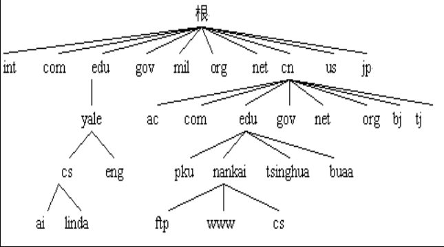
#### 域名地址
* IP地址为Internet提供了统一的寻址方式，直接使用IP地址便可以访问Internet中的主机资源
#### 域名系统
* **域名系统**：把域名翻译成IP地址的软件
* **域名服务器**：运行域名系统的主机
* 每个网络要设置一个域名服务器，通过域名服务器来实现入网主机名字和IP地址的转换
## 以太网中的CSMA/CD的工作过程
* 以太网
  * 指各种采用CSMA/CD技术（载波监听多路访问及冲突检测技术）的局域网
  * 特点
    * 数据传输可靠、组网方便、灵活、价格低、标准化程度高
  * 基本拓扑结构：总线型
  * 以太网介质访问控制协议：CSMA/CD
  * 以太网帧格式
# 三，计算机软件
## $\underline{软件的定义}$，分类
### $\underline{软件的定义}$
* 指在计算机上运行的程序及其数据和维护文档的总和
  * 程序是软件的主体
  * 数据指的是程序运行过程中处理的对象和必须使用的一些参数
  * 文档则指的是与程序开发、维护及操作有关的一些资料
### 软件的分类
#### 系统软件
  * 是负责对整个计算机系统资源的管理、调度、监视和服务
  * 与具体的应用领域无关，而与计算机硬件系统有很强的交互性，要**对硬件共享资源进行调度管理**。
#### 应用软件
  * 利用计算机的软、硬件资源为某一应用领域解决某个实际问题而专门开发的软件
## 计算机语言：$\underline{机器语言，汇编语言和高级语言}$，与及各语言的特性与执行过程
### $\underline{计算机语言}$
* 机器语言(机器码)
  * 以二进制编码表示的指令
  * 分为两部分(操作码，操作数地址)
  * 特征：难记，难理解，效率低，不易维护
* 汇编语言(符号语言程序)
  * 采用英文字母、符号来表示指令操作码、寄存器、数据和存储地址等，并在程序中用它们代替二进制编码数
  * 大多数情况下，一条汇编指令对应一条机器指令，少数对应几条机器指令
  * 抽象层次很低，可移植性差，麻烦
  * 执行过程
    $汇编语言源程序\xrightarrow[汇编程序库函数]{汇编(翻译)和连接}\xrightarrow[原始数据]{运行}运行结果$
* 高级语言
  * 抽象层次提高，比较接近自然语言，可移植性较好
  * 程序较短，易学习，使用方便，通用性强，便于推广，交流
  * 源程序从编译到执行
    $源程序\xrightarrow[]{编译}目标程序\xrightarrow[]{连接}可执行程序\xrightarrow[]{执行}运行结果$
  * 特点
    * 名字说明：具有合法性
    * 类型说明：确定定义变量的类型和使用方式
    * 初始化：预设值
    * 程序对象的局限性：仅有需要调用的部分才能访问
    * 程序模块：分模块完成不同功能
    * 循环控制结构：程序自动运行，充分利用机器速度
    * 分支控制结构：根据条件控制执行
    * 异常处理：定义异常处理，防止程序出错
    * 独立编译：分模块编译，容易调试和组装
## 操作系统的概念，$\underline{主要作用，功能}$,层次结构，启动过程和分类
### 操作系统概念
* 操作系统是一组程序的集合，它是系统软件的主要组成部分
* 直接管理和控制计算机的所有硬件和软件，使计算机系统的各部件相互协调一致地工作
* 向用户提供正确地利用软硬件资源的方法和环境，使得用户能够通过操作系统充分而有效地使用计算机
* 操作系统是用户与计算机系统之间的接口
### $\underline{操作系统书主要作用}$
* 提高系统资源的利用
  * 通过对计算机系统的软、硬件资源进行合理的调度与分配，改善资源的共享和利用状况，最大限度地发挥计算机系统工作效率，
* 提供方便友好用户界面
* 提供软件开发的运行环境
* 任何一种软件并不是在任何一种系统上都可以进行的，所以操作系统也称为软件平台
  * 操作系统的性能在很大程度上决定了计算机系统性能的优劣
### $\underline{操作系统的功能}$
* **作业管理**
  * 作业是指用户请求计算机系统完成的一个独立任务，它必须经过若干个加工步骤才能完成
  * 每一个加工步骤称为作业步
  * 作业管理包括作业的调度与控制两个方面
* **文件管理**(文件系统)
  * 文件是一组完整的信息集合。计算机中的各种程序和数据均为计算机的软件资源，它们以文件的形式存放在外存中
  * 对文件的管理主要包括
    * 文件目录管理
    * 文件存储空间分配
    * 为用户提供灵活方便的操作命令
    * 处理机
* **处理机管理**(CPU管理)
  * 管理要解决的问题主要有解决CPU的分配策略、实施方法等。
  * CPU管理的另一个工作是处理中断
* **存储管理**
  * 计算机系统的内存空间分成两个区域。
    * 一个是系统区，用于存放操作系统、标准子程序和例行程序
    * 另一个是用于存放用户程序。
  * 要解决多道程序在内存中的分配，保证各道程序互不冲突，并且通过虚拟内存来扩大存储空间。
  * **虚拟内存**：使得应用程序认为它拥有连续的可用的内存（一个连续完整的地址空间
* **设备管理**
  * 设备管理便是用于对输入输出设备进行控制和管理的一组程序
### 操作系统层次结构
* 操作系统中定义了它的内核层和它与用户之间的接口

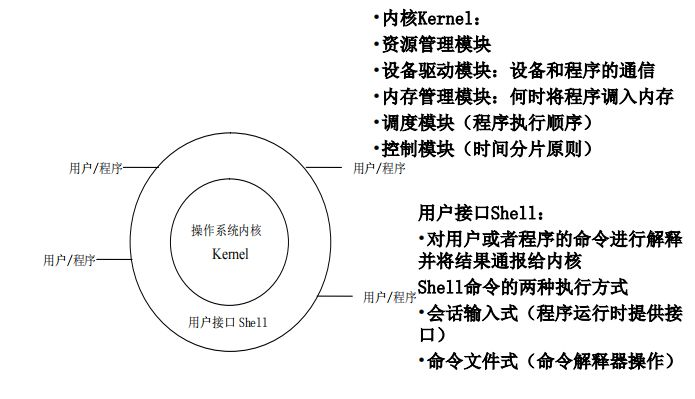
### 操作系统启动过程
1. 机器加电(或按下Reset)
2. CPU自动运行BIOS的自检程序
3. CPU自动运行BIOS的自举程序，从外部存储设备的引导扇区读出引导程序装入内存
4. CPU运行引导程序，从外部存储设备读出操作系统装入内存
5. CPU运行操作系统
### 操作系统分类
* 单用户操作系统
  * MS-DOS，单用户单任务操作系统
  * WindowsXP单用户多任务操作系统
* 批处理操作系统
  * 可以管理多个用户的程序
  * 在批处理操作系统的管理下运行，以提高计算机系统的效率
  * Windows Server操作系统
* 分时操作系统
  * 可支持多个终端用户同时使用计算机
  * 采用给每个用户固定的时间片的方式，轮流为各个用户服务
  * UNIX系统
* 实时操作系统
  * 对最短的响应时间有严格的要求
* 网络操作系统
  * 用于管理相互连接的一组具有独立功能的计算机
  * 组成网络的计算机虽在网络操作系统的统一管理之下，但同时在各自的操作系统运行，并遵守相同的网络协议，使计算机间通信
  * UNIX、Netware及Windows NT
* 分布式操作系统
  * 管理分布式计算机网络系统的操作系统
  * 各计算机可以相互协作共同完成任务
## $\underline{结合理解程序，进程(状态)，线程之间的关系}$
### $\underline{程序}$
* 程序是为实现某个目标编写的指令序列
* 在计算机系统中只有一个程序在运行时，这个程序独占系统所有资源，其执行不受外界影响
* 特征
  * **顺序性**：程序所有操作按规定的顺序执行
  * **封闭性**：程序在执行过程中独享系统资源，不受外界因素的干扰和影响
  * **可再现性**。程序执行的结果与其执行速度无关。只要初始条件相同，结果总相同
* **并发**：多个任务（程序）同时驻留主存，通过轮流使用处理机得以运行，在一个时间段中，宏观上同时执行多个程序
  * 并发是提高系统资源利用率的有效途径
### $\underline{进程}$
* **进程**：程序在一个数据集合(程序所处理的数据)上的一次**运行过程**，是操作系统进行资源分配与调度的基本单位
* 进程与程序的区别
  * 进程是动态的，程序是静态的
  * 进程是暂时的，程序是永久的
  * 进程的组成包括**程序**，**操作的数据**和**系统为管理进程记录的进程状态信息**
  * 多次执行时，一个程序可对应多个进程
* 进程的状态

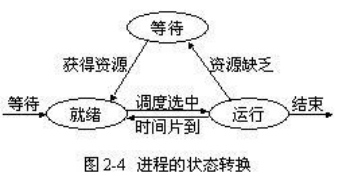
  * 就绪状态：等待分配处理机资源
  * 运行态：进程占用处理机资源正在运行
  * 阻塞态：等待引起阻塞的原因解除进入就绪态
* 进程的进程控制块(PCB)
  * 操作系统为了对进程进行有效管理所记录的每个进程的相关信息
* 进程控制
  * 调度和管理进程整个生存周期，包括进程创建、调度进程执行，转变进程状态，撤消进程并回收进程所使用的系统资源等
### $\underline{线程}$
* 线程
  * 进程中的一个运行实体，它是一个处理机的调度单位，资源的拥有者是进程
  * 目的：简化进程间的通信，提高进程内的并发程度
  * 进程可创建线程执行同一程序的不同部分，即一个进程中的多个线程可并发执行
## $\underline{软件的开发过程与模型}$
### $\underline{软件开发过程}$
1. 立项分析(可行性分析)
  * 功能，工作量(周期(单位(人·月/人·天)*工作量*1.5)，成本 
2. 需求分析
3. 概要分析(功能模块，用户角色，网络，硬件，环境)
4. 详细设计(数据方案设计，业务流程设计，页面设计)
5. 编码(编码规范)
6. 测试(单元测试，交叉测试，联调测试，回归测试，上线测试，边界测试)
7. 上线运行
8. 运行维护
### $\underline{软件开发过程模型}$
* 软件开发瀑布模型
  * 不支持软件产品的演化
  * 开发过程中的一些很难发现的错误只有在最终产品运行时才能发现，所以最终产品将难以维护

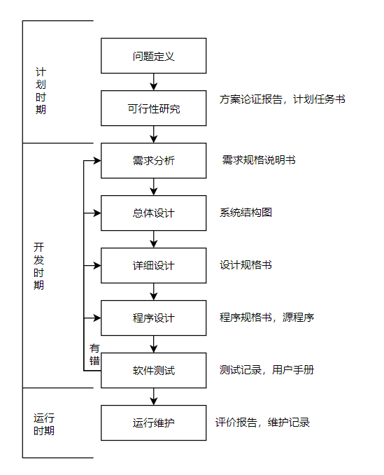
* 软件开发增量模型
  * 统可以很好地满足用户的需求

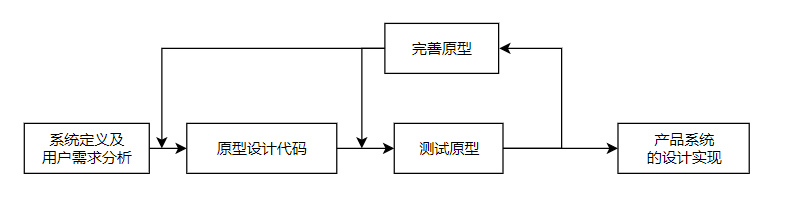
* 软件重用模型
* 旨在开发具有各种一般性功能的软件模块，将它们组成软件重用库，这些模块设计时考虑其适应各种界面的接口规格，可供软件开发时利用
# 四，计算机基础
## 数据库系统的相关概念
### 信息
#### 定义
* **信息**是关于现实世界事物的存在方式或运动状态的反映的综合，即被加工为特定形式的数据,有实际意义
#### 特征
* 源于物质和能力
* 是可感知的
* 是可存储，加工传递和再生的
### 数据
#### 定义
* **数据**是用来记录信息的可识别的符号，是信息的具体表现形式
* 数据是数据库中存储的基本对象，是事实的反映和记录
#### 表现形式
* 可用多种不同的数据形式表示同一信息，而信息不随数据形式的不同而改变
### 数据与信息的关系
* 数据是信息的符号表示或载体，信息则是数据的内涵，是对数据的语义解释
### 数据处理
#### 定义
* **数据处理**是将数据转换成信息的过程，包括对数据的收集、存储、加工、检索、传输等一系列活动
* 为了产生信息而处理数据
#### 目的
* 从大量的原始数据中抽取和推导出有价值的信息，作为决策的依据
#### 三者关系
* 信息=数据+数据处理
### 数据库
* 数据库是指在计算机存储设备上合理存放的结构化的相关数据集合
### 数据库管理系统
* 位于用户和操作系统之间的一层数据管理软件，用来操纵和管理数据库，是数据库系统的核心
### 数据库系统
* 一般由数据库、数据库管理系统(及其开发工具)、应用系统、数据库管理员和用户构成
## $\underline{常用的数据模型：树，网，关系，其中关系模型的特点}$
### $\underline{层次模型}$
* 用树形结构表示数据之间的联系
  * 树由结点和连线组成，结点表示现实世界中的实体集，连线表示实体之间的联系
* 特点
  * 有且只有一个结点无双亲（上级结点），此结点叫根结点
  * 其他节点有且只有一个双亲结点
  * 双亲结点与子女(下级)结点之间的联系只能表示实体与实体之间一对多的对应关系
### $\underline{网状模型}$
* 特点
  * 允许多个结点没有双亲结点
  * 允许一个结点可以有多于一个的双亲
  * 还允许两个结点之间有多种联系
### $\underline{关系模型}$
#### 基本思想
* 把事物与事物之间的联系用二维表格的形式来描述
* 一个关系可以看着一张二维表
  * 表中的每一行是一个记录，在关系中称为元组
  * 表中的每一列是一个字段，在关系中称为属性
#### $\underline{特点}$
  * 表格中的每一列都是不可再分的基本属性
  * 各列被指定一个相异的名字
  * 各行不允许重复
  * 行、列的次序无关
#### 相关概念
* **关系**：一个关系就是一张二维表，每个关系有一个关系名。在计算机中，一个关系可以存储为一个文件
* **属性**：二维表中垂直方向的列称为属性，也叫做一个字段
* **域**：一个属性的取值范围叫做一个域
* **元组**：二维表中水平方向的行称为元组，也叫做一条记录
* **码(关键字)**：二维表中的某个属性，若它的值唯一地标识了一个元组，则称该属性为码
## 关系数据库标准语言SQL，能读懂SQL语句，SQL数据库的体系结构
* SQL是一种基于关系代数和关系演算之间的结构化查询语言
### SQL功能动词

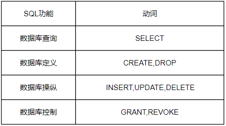
### SQL数据库的体系结构
* SQL数据库具有三级模式体系结构

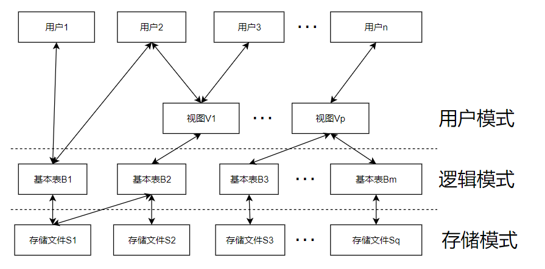
  * **SQL视图对应于**用户模式**
  * **SQL基本表**对应于数据库的**逻辑模式**
  * **存储文件**对应于数据库的**存储模式**
## 数据库中$\underline{表，视图}$的差异
* **基本表**：独立存在的表，不是由其它的表导出的表。一个关系对应一个基本表，一个或多个基本表对应一个存储文件
* **视图**：是一个虚拟的表，是从一个或几个基本表导出的表。它本身不独立存在于数据库中，数据库中只存放视图的定义而不存放视图对应的数据，这些数据仍存放在导出视图的基本表中
## 关系数据库中的$\underline{安全性和完整性}$
### 安全性
* 主要包括三方面
  * **用户身份标识和鉴别**
  * **存储权限控制策略**
  * **数据加密技术**
### 完整性
* 指数据的**正确性**及**相容性**
  * 合法用户对数据的增删改必须符合一定的语义，有时要通过几种完整性约束条件来保证
* **实体完整性**：指主关系键的值不能为空或部分为空。 关系模型中的一个元组对应一个实体，一个关系则对应一个实体集
* **引用完整性**： 要求在关系中不允许引用不存在的实体
* **用户定义完整性约束**：反映某一具体应用所涉及的数据必须满足的语义要求，由应用环境对数据的需求而决定
* 实体完整性和引用完整性是关系模型必须满足的完整性约束条件，被称作关系的**两个不变性**
## $\underline{信息安全相关概念，数据加密技术，计算机病毒定义与特征}$
### 信息安全定义
* 指对信息资源实施保护，以防止信息资源被泄漏、修改、破坏
### 包括以下层面
* **理念**：良好的监控、完善的记录、定期检查/检测
* **观点**：网络安全具有整体性、网络安全需要规划、网络安全是动态的
* **机制**：加密机制、数字签名机制、访问控制机制等、
* 分类
  * **设备安全**
  * **行为安全**
  * **数据安全**
  * **内容安全**
* 安全模型——P2DR

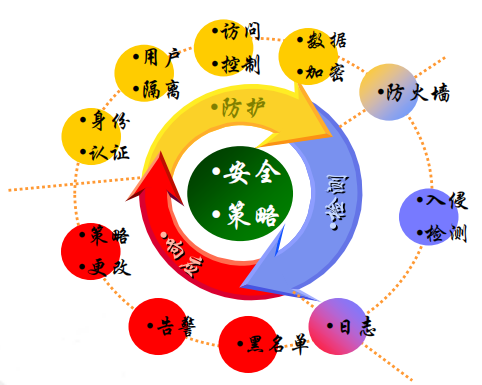
### 数据加密技术
#### 对称式加密法

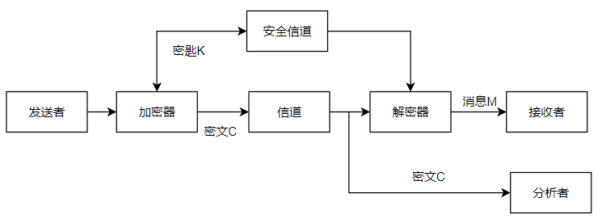
* 加密和解密使用同一密钥
#### 非对称式加密法

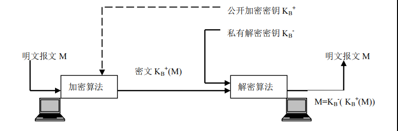
* 采用两个密钥将加密和解密分开
* 一个密钥公开，作为加密密钥，叫做公钥
* 一个为用户专用，作为解密密钥，叫做私钥
* 两个密钥必须配对使用才有效
* 通信双方无需事先交换密钥就可进行保密通信
### 计算机病毒
#### 定义
* 一组人为制造，能够进行自我传播、需要用户干预来触发执行的、对计算机资源具有破坏性的程序或代码
#### 分类
* 引导型病毒：引导型病毒是指寄生在磁盘引导区或主引导区的计算机病毒
* 文件型病毒：文件型病毒是指能够寄生在文件中的计算机病毒
* 复合型病毒：兼具有引导型病毒和文件型病毒的特性
#### 特点
  * 传染性
  * 破坏性
  * 寄生性
  * 隐蔽性
  * 程序性(可执行性)
  * 潜伏性
  * 可触发性
  * 衍生性
  * 欺骗性
  * 不可预见性
# 五，计算机科学
## 计算机的学科方法论
* 三个过程
  * 理论
  * 抽象(模型化)
  * 设计
* 核心概念
  * 绑定
  * 复杂性
  * 概念和形式模型
  * 一致性和完备性
  * 效率
  * 演化
  * 抽象层次
  * 按空间，时间排序
  * 重用
  * 安全性
  * 折衷与结论
* 核心方法
  * 数学方法
  * 系统科学方法
## 计算机带来的影响(道德，法律，教育等)
* 个人
* 社会

